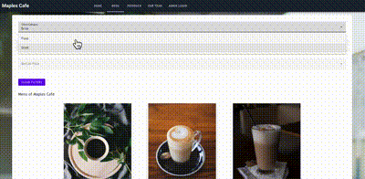

# Maples Café Website

## Introduction

This is the Vue.js source code for the Maples Café website, a modern and interactive web application built to showcase the best of what our café has to offer. The site is developed using Vue.js to ensure a smooth and responsive user experience.

<p align="center">
  
  
  
   <br />
  
  
  
   <br />
  
  
  
   <br />
  
  
  
   <br />
  
  
  
   <br />
  <i>Sample results</i>
</p>

## Motivation

The goal of this project is to create an elegant and user-friendly website for Maples Café, allowing customers to easily browse our menu, learn more about our services, and connect with us. The website is designed to be responsive, accessible, and visually appealing, reflecting the quality and style of our café.

## Features

- **Interactive Menu**: Browse our diverse menu with high-quality images and detailed descriptions.
- **Online Review**: Easily review at our café through a seamless review system.
- **Location and Contact**: Find our café on the map, view our hours of operation, and contact us with any inquiries.
- **Responsive Design**: Optimized for desktops, tablets, and mobile devices to ensure a great experience on any screen size.
- **Smooth Animations**: Enhance user experience with subtle and engaging animations throughout the site.
- **Apply job instant**: Quickly apply job directly thru our amazing website and wait for your result within a day.

## How to Use

To get started with the development or to deploy the Maples Café website, follow the instructions below:

### Project setup

```bash
npm install
```

### Compiles and hot-reloads for development
```bash
npm run serve
```


